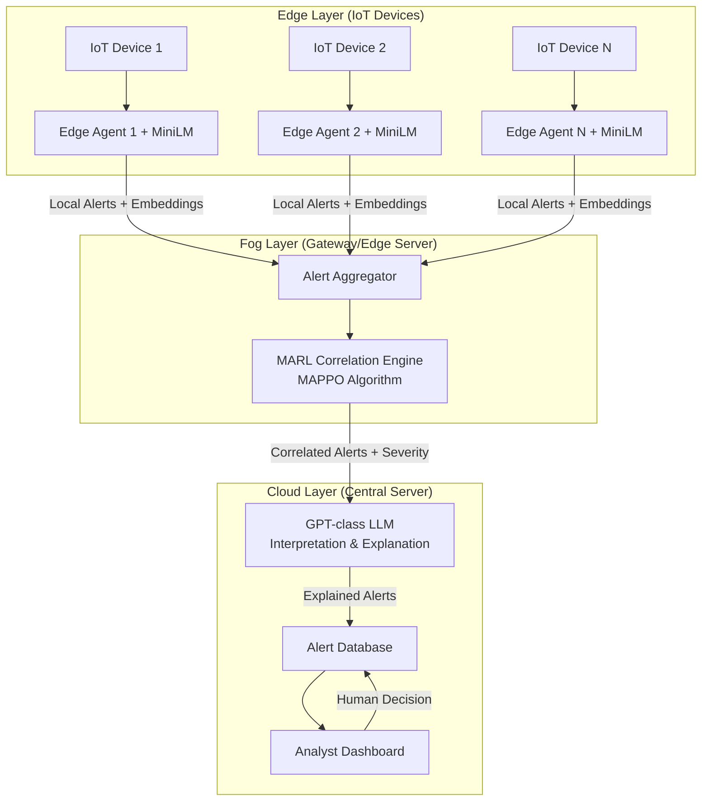

# LLM-Enhanced Multi-Agent Reinforcement Learning for IoT Intrusion Detection: A Research Specification

**Authors:** [To be added]  
**Affiliation:** [To be added]  
**Target Venue:** IEEE Transactions on Dependable and Secure Computing / IEEE Internet of Things Journal  
**Date:** February 2026

---

## Abstract

This document presents a complete research-grade specification for a novel Intrusion Detection System (IDS) designed for Internet of Things (IoT) environments. The system integrates three key technologies: (1) **Multi-Agent Reinforcement Learning (MARL)** for distributed, cooperative threat correlation; (2) **Large Language Models (LLMs)** for semantic feature encoding and human-interpretable explanations; and (3) **Self-play adversarial training** for improved robustness against adaptive attackers. The architecture is **strictly detection-only**, with no autonomous defense, mitigation, or response capabilities, ensuring safety and human oversight. The system operates across three hierarchical layers (Edge, Fog, Cloud) to balance resource constraints, latency requirements, and detection accuracy. We provide formal reinforcement learning definitions, experimental protocols, ablation studies, and explainability mechanisms suitable for peer-reviewed publication.

---

## 1. Introduction and Motivation

### 1.1 Problem Statement

Modern IoT environments face increasingly sophisticated cyber threats, including multi-stage attacks, coordinated botnets, and adaptive adversaries capable of evading traditional signature-based and anomaly-based IDS. Existing approaches suffer from:

1. **Limited semantic understanding**: Traffic-level features lack context about device behavior, attack intent, and relationships.
2. **Centralized detection bottlenecks**: Cloud-only IDS introduce latency and privacy concerns.
3. **Static learning paradigms**: Supervised ML models fail under concept drift and non-stationary IoT traffic.
4. **Lack of adversarial robustness**: Training on historical datasets does not prepare models for adaptive attackers.
5. **Poor explainability**: Black-box ML/DL models lack interpretability for security analysts.

### 1.2 Research Objectives

This work aims to design an IDS that:

- **Distributes intelligence** across Edge, Fog, and Cloud layers to balance resource constraints and accuracy.
- **Leverages LLMs** for semantic encoding (Edge) and explanation generation (Cloud), without decision-making authority.
- **Employs MARL** (Fog) for cooperative alert correlation across multiple IoT devices.
- **Uses self-play** during training to improve robustness against adaptive attackers, while maintaining strict IDS-only behavior during deployment.
- **Ensures safety** by prohibiting autonomous defense actions and maintaining human oversight.

---

## 2. Scope and Safety Constraints

### 2.1 IDS-Only Operation

> [!CAUTION]
> **Critical Design Constraint**: The system is an **Intrusion Detection System ONLY**. It is **NOT** an Intrusion Prevention System (IPS), Intrusion Response System (IRS), or autonomous defense system.

**Allowed Outputs:**
- Intrusion alerts (binary or multi-class)
- Attack type classification (e.g., DDoS, reconnaissance, data exfiltration)
- Attack stage inference (e.g., MITRE ATT&CK for IoT stages)
- Severity and risk scores (0-100 scale)
- Human-readable explanations (LLM-generated text)
- Confidence scores and uncertainty estimates

**Prohibited Actions:**
- Blocking traffic or connections
- Quarantining or isolating devices
- Modifying firewall rules
- Rate limiting or throttling
- Automatic patch deployment
- Autonomous countermeasures of any kind

### 2.2 Self-Play Constraints

> [!WARNING]
> Self-play is **ONLY** active during training. The adversarial attacker agent is **NEVER** deployed in production.

**Training Time:**
- A constrained attacker agent (based on MITRE ATT&CK for IoT) generates adversarial examples.
- LLM assists in scenario generation (timing, ordering, combinations).
- Attacker action space is bounded to realistic IoT attacks.

**Deployment Time:**
- Only the MARL defender agents and LLM components are deployed.
- No self-play, no attacker agent, no adaptive adversarial learning.

### 2.3 Safety Justification

| **Design Choice** | **Safety Rationale** |
|-------------------|----------------------|
| Detection-only outputs | Prevents accidental service disruption, maintains availability |
| No autonomous blocking | Avoids false positive-induced DoS against legitimate devices |
| Human-in-the-loop | Security analysts retain final authority over response actions |
| Bounded attacker agent | Prevents learning of unrealistic or destructive attack strategies |
| LLM as encoder/explainer only | Prevents hallucination-driven false alarms or unauthorized actions |
| Hierarchical trust model | Edge/Fog agents have limited authority; Cloud provides oversight |

**Trust Model:**
- **Edge agents**: Low trust, limited to local feature extraction and anomaly scoring.
- **Fog agents**: Medium trust, correlation and severity inference only.
- **Cloud LLM**: High trust, but strictly for interpretation and explanation, not enforcement.

---

## 3. System Architecture

### 3.1 Hierarchical Design Overview

The system operates across three layers:



### 3.2 Edge Layer: Lightweight Semantic Encoding

**Purpose:** Extract features, encode semantic state, perform local anomaly detection.

**Components:**
- **Traffic Monitor**: Captures network packets, flow statistics (NetFlow/IPFIX).
- **Device Context Collector**: Gathers device type, firmware version, expected behavior profiles.
- **MiniLM Semantic Encoder**: 
  - Model: MiniLM-L6 or DistilBERT (22M-66M parameters)
  - Input: Protocol sequences, payload snippets (sanitized), flow metadata
  - Output: 384-dimensional semantic embedding vector
  - Inference time: <10ms per sample (on edge GPU/NPU)

**Tasks:**
1. **Feature Extraction**: Statistical features (packet size, inter-arrival time, protocol distribution).
2. **Semantic Encoding**: LLM converts raw traffic into dense embeddings capturing behavioral semantics.
3. **Local Anomaly Scoring**: Simple threshold-based or one-class SVM for preliminary anomaly detection.

**Output to Fog:**
- Feature vector **f** (statistical + semantic)
- Local anomaly score **a_local** ∈ [0, 1]
- Device ID and timestamp

**Resource Constraints:**
- CPU: ARM Cortex-A72 or equivalent
- Memory: <512MB for edge agent
- Latency: <50ms per traffic sample

**No Decision Authority:** Edge agents **cannot** raise global alerts. They only contribute to Fog-layer correlation.

### 3.3 Fog Layer: MARL Correlation Engine

**Purpose:** Correlate alerts from multiple edge agents, infer attack likelihood and severity.

**Algorithm:** Multi-Agent Proximal Policy Optimization (MAPPO)
- **Cooperative MARL**: Agents share a global reward but have decentralized execution.
- **Communication**: Parameter sharing or message passing for coordination.

**State Space (per agent):**
- **Local observations**: Feature vector **f_i** from edge agent **i**
- **Neighbor observations**: Features {**f_j**} from spatially/temporally related agents
- **Temporal history**: Sliding window of past **T** observations (e.g., T=10)
- **Global context**: Network topology, device relationships

**Action Space (per agent):**
Each agent outputs:
1. **Alert Level**: {No Alert, Low, Medium, High, Critical}
2. **Attack Type**: {DDoS, Malware, Reconnaissance, Data Exfiltration, None}
3. **Confidence Score**: ∈ [0, 1]

**No Enforcement Actions:** Agents cannot block, isolate, or modify traffic.

**Communication Protocol:**
- Agents exchange lightweight messages (embeddings, scores) over local network.
- Latency budget: <100ms for correlation decision.

**MAPPO Training Details:**
- **Centralized Critic**: Global value function V(s) for all agents.
- **Decentralized Actors**: Policy π_i(a_i | o_i) per agent.
- **Parameter Sharing**: Agents share policy network weights (homogeneous agents).

**Data Flow:**
1. Edge agents send (f_i, a_local_i) to Fog aggregator.
2. Aggregator constructs global state **s** = {f_1, ..., f_N, topology}.
3. MARL agents jointly decide alert levels and attack types.
4. High-severity alerts forwarded to Cloud LLM.

### 3.4 Cloud Layer: LLM Interpretation and Explanation

**Purpose:** Provide human-interpretable explanations for high-severity alerts.

**Components:**
- **LLM Interpreter**: GPT-4 class model (or open-source equivalent like Llama-3-70B)
- **MITRE ATT&CK Mapper**: Maps attack types to ATT&CK for IoT stages
- **Explanation Generator**: Produces natural language summaries

**Input:**
- Correlated alert from Fog layer (attack type, severity, confidence)
- Raw features and semantic embeddings
- Device context (type, firmware, recent behavior)

**LLM Prompt Template:**
```
You are a cybersecurity analyst assistant. Given the following IoT network alert:
- Device: {device_id} ({device_type})
- Alert Type: {attack_type}
- Severity: {severity}/100
- Features: {feature_summary}
- Temporal Context: {temporal_summary}

Provide:
1. A concise explanation of the detected behavior.
2. Likely attack stage (MITRE ATT&CK for IoT).
3. Recommended analyst actions (observational only, no enforcement).
4. Confidence justification.

Constraints: Be factual, avoid speculation, and do NOT suggest automated blocking or mitigation.
```

**Output:**
- **Explanation Text**: 100-200 word summary
- **ATT&CK Stage**: (e.g., "Initial Access - Exploitation of Remote Services")
- **Analyst Recommendations**: (e.g., "Inspect device logs for suspicious API calls")

**No Autonomous Actions:** LLM output is **descriptive only**. It does not trigger any automated defense.

**Latency:** <2 seconds for explanation generation (acceptable for high-severity alerts sent to analysts).

---

## 4. Reinforcement Learning Formulation

### 4.1 MARL Framework

**Multi-Agent Decentralized Partially Observable Markov Decision Process (Dec-POMDP):**

- **Agents**: N edge/fog agents, one per IoT device or subnet
- **Observation Space**: O_i = {f_i, a_local_i, neighbor_features, temporal_history}
- **Action Space**: A_i = {alert_level, attack_type, confidence}
- **Transition Dynamics**: P(s' | s, a_1, ..., a_N) (environment response to joint actions)
- **Reward Function**: R(s, a_1, ..., a_N) (joint reward, detailed below)
- **Policy**: π_i(a_i | o_i, θ) (decentralized policy per agent)
- **Goal**: Maximize expected cumulative reward E[Σ γ^t R_t]

### 4.2 State Space Design

**Per-Agent Observation** o_i ∈ ℝ^d consists of:

1. **Traffic Features** (dimension: 50):
   - Packet count, byte count, flow duration
   - Inter-arrival time statistics (mean, std, median)
   - Protocol distribution (TCP, UDP, MQTT, CoAP percentages)
   - Port statistics (source/destination port entropy)
   - Packet size distribution (mean, std, 95th percentile)

2. **Semantic Embedding** (dimension: 384):
   - MiniLM output vector capturing protocol behavior semantics

3. **Temporal History** (dimension: 10 × (50+384)):
   - Sliding window of past T=10 observations

4. **Device Context** (dimension: 20):
   - Device type (one-hot encoded)
   - Firmware version hash
   - Expected traffic profile (learned during calibration)
   - Trust score (based on past behavior)

5. **Spatial Context** (dimension: 50):
   - Neighbor device features (aggregated embeddings)
   - Network topology (graph neural network embeddings)

**Total dimension per agent**: ~5,000-10,000 (manageable for MAPPO)

**Handling Non-Stationarity:**
- **Sliding window normalization**: Features normalized over recent T samples.
- **Adaptive baselines**: Reward baseline updated online.
- **Periodic retraining**: Model retrained weekly on new data.

**Concept Drift Detection:**
- Monitor distribution shift in feature space (e.g., KL divergence).
- Trigger retraining if drift exceeds threshold.

### 4.3 Action Space Design (IDS-Centric)

Each agent outputs a **tuple** (alert_level, attack_type, confidence):

1. **Alert Level** ∈ {0, 1, 2, 3, 4}:
   - 0: No Alert
   - 1: Low (informational)
   - 2: Medium (anomalous)
   - 3: High (likely attack)
   - 4: Critical (confirmed attack)

2. **Attack Type** ∈ {None, DDoS, Malware, Reconnaissance, Data Exfiltration, Command Injection, Firmware Manipulation}:
   - Based on MITRE ATT&CK for IoT taxonomy

3. **Confidence** ∈ [0, 1]:
   - Agent's certainty about the alert (used for prioritization)

**Why These Actions Are IDS-Only:**
- **No enforcement**: Actions describe detection outputs, not system modifications.
- **Human-consumable**: Alerts sent to dashboard for analyst review.
- **Probabilistic**: Confidence scores allow uncertainty quantification.

**Discrete vs Continuous:**
- Alert level and attack type: Discrete (easier for analysts)
- Confidence: Continuous (enables nuanced risk assessment)

### 4.4 Reward Function Design

**Multi-Objective Reward** balances detection accuracy, false positive reduction, latency, and resource cost:

**R(s, a) = w_1 · R_detect + w_2 · R_FP + w_3 · R_latency + w_4 · R_resource**

Where:
- w_1 = 1.0 (detection priority)
- w_2 = -0.5 (penalize false positives)
- w_3 = -0.2 (penalize latency)
- w_4 = -0.1 (penalize resource usage)

**Component Definitions:**

1. **Detection Reward** R_detect:
   - **True Positive (TP)**: +10 (correctly detected attack)
   - **True Negative (TN)**: +1 (correctly ignored benign traffic)
   - **False Negative (FN)**: -20 (missed attack, highest penalty)
   - **False Positive (FP)**: -5 (false alarm, moderate penalty)

   Formula: R_detect = 10·TP + 1·TN - 20·FN - 5·FP (per timestep)

2. **False Positive Penalty** R_FP:
   - Penalizes alert fatigue: R_FP = -α · (FP_rate - threshold)
   - If FP_rate > 0.01 (1%), apply additional penalty
   - Encourages high precision

3. **Latency Penalty** R_latency:
   - R_latency = -β · (t_decision - t_event)
   - Penalizes slow detection (e.g., detecting attack 10 seconds late)
   - Encourages real-time responsiveness

4. **Resource Cost** R_resource:
   - R_resource = -γ · (CPU_usage + Memory_usage + Network_bandwidth)
   - Encourages lightweight edge agents
   - Normalized to [0, 1] per resource type

**Why This Reward Is Suitable for IDS (NOT Defense):**

| **Property** | **IDS Suitability** |
|-------------|---------------------|
| No enforcement reward | Reward does not depend on blocking or mitigation actions |
| Penalizes FN heavily | IDS goal is to **detect** attacks, not prevent them (prevention is analyst's job) |
| Balances precision/recall | Avoids both missed attacks (FN) and alert fatigue (FP) |
| Latency-aware | IDS must alert quickly for timely human response |
| Resource-conscious | Edge devices have constrained resources |

**Contrast with Defense Reward:**
- A defense system would reward **attack success prevention** (e.g., "number of malicious packets blocked").
- This IDS reward only considers **detection accuracy**, not attack outcomes.

### 4.5 MAPPO Training Algorithm

**Pseudocode:**

```
Initialize:
  - Policy networks π_θ for all agents (shared parameters)
  - Value network V_φ (centralized critic)
  - Replay buffer D

For each training episode:
  1. Reset environment, initialize states s_0
  2. For t = 0 to T_max:
       a. Each agent observes o_i_t
       b. Sample actions a_i_t ~ π_θ(·|o_i_t)
       c. Execute joint action {a_1_t, ..., a_N_t}
       d. Observe reward R_t and next state s_t+1
       e. Store (o_i_t, a_i_t, R_t, o_i_t+1) in D
  3. Compute advantages A_t = R_t + γV(s_t+1) - V(s_t)
  4. Update policy:
       θ ← θ + α ∇_θ E[min(r_t(θ)A_t, clip(r_t(θ), 1-ε, 1+ε)A_t)]
       where r_t(θ) = π_θ(a_t|o_t) / π_θ_old(a_t|o_t)
  5. Update value function:
       φ ← φ - β ∇_φ E[(V_φ(s_t) - R_t)^2]
```

**Key Hyperparameters:**
- Learning rate α: 3e-4
- Discount factor γ: 0.99
- GAE parameter λ: 0.95
- Clip range ε: 0.2
- Episode length T_max: 1000 timesteps
- Batch size: 4096 transitions

---

## 5. Self-Play Adversarial Training (Training Only)

### 5.1 Motivation

Traditional supervised IDS training assumes:
- Fixed attack distributions (dataset bias)
- Static attacker strategies (no adaptation)

**Self-play** enables:
- **Adaptive adversarial training**: Attacker agent learns to exploit defender weaknesses.
- **Dynamic attack scenarios**: LLM generates diverse attack sequences.
- **Robustness**: Defender learns to handle unseen attacks.

> [!WARNING]
> Self-play is **STRICTLY** a training mechanism. The attacker agent is **NEVER** deployed.

### 5.2 Constrained Attacker Agent Design

**Action Space (Bounded by MITRE ATT&CK for IoT):**

The attacker agent selects from a **finite, enumerated** set of attacks:

1. **Initial Access**:
   - Exploit Remote Services (e.g., SSH brute force)
   - Phishing (via IoT app UI)

2. **Execution**:
   - Command Injection (MQTT/CoAP payload manipulation)
   - Malware Deployment (firmware trojan)

3. **Persistence**:
   - Modify System Firmware
   - Scheduled Task Injection

4. **Privilege Escalation**:
   - Exploit Vulnerability (buffer overflow)

5. **Defense Evasion**:
   - Traffic Obfuscation (encryption, protocol tunneling)
   - Low-and-Slow Attacks (spread over time)

6. **Collection**:
   - Data Exfiltration (sensor readings, credentials)

7. **Impact**:
   - DDoS (SYN flood, amplification)
   - Resource Exhaustion

**Total Action Space**: ~20-30 discrete attack types (realistic and implementable in simulation).

**Constraints:**
- **No unbounded learning**: Attacker cannot invent arbitrary new attacks.
- **Physical realism**: Attacks must be technically feasible on IoT devices.
- **MITRE alignment**: All attacks mapped to ATT&CK for IoT.

### 5.3 LLM-Assisted Scenario Generation

**LLM Role (Training Time Only):**

The LLM (e.g., GPT-4) generates **attack scenarios** to diversify training:

**Input Prompt:**
```
Generate a realistic IoT attack scenario using MITRE ATT&CK for IoT.
Specify:
- Attack goal (e.g., exfiltrate sensor data)
- Attack stages (sequence of tactics)
- Timing (pacing, delays between stages)
- Target devices (smart thermostat, IP camera, etc.)

Constraints:
- Use only techniques from MITRE ATT&CK for IoT
- Ensure physical feasibility
- Avoid unrealistic multi-hop exploits
```

**LLM Output:**
```json
{
  "goal": "Exfiltrate temperature sensor data",
  "stages": [
    {"tactic": "Initial Access", "technique": "Exploit Remote Services", "delay_sec": 0},
    {"tactic": "Execution", "technique": "Command Injection", "delay_sec": 300},
    {"tactic": "Collection", "technique": "Data Staged", "delay_sec": 600},
    {"tactic": "Exfiltration", "technique": "Exfiltration Over C2 Channel", "delay_sec": 900}
  ],
  "target_device": "Smart Thermostat"
}
```

**Benefits:**
- **Diversity**: LLM generates thousands of varied scenarios.
- **Temporal variation**: Delays and orderings prevent temporal overfitting.
- **Contextual realism**: Device-specific attacks.

**Safeguards:**
- LLM outputs validated against MITRE ATT&CK taxonomy.
- Human expert reviews scenario pool before training.

### 5.4 Self-Play Training Loop

**Training Architecture:**


**Algorithm:**

```
For each training epoch:
  1. LLM generates K attack scenarios
  2. For each scenario:
       a. Initialize environment with scenario parameters
       b. Attacker agent selects attack sequence
       c. Environment simulates attacks on IoT devices
       d. Defender agents observe traffic and raise alerts
       e. Compute rewards:
            - Attacker: +reward if attack succeeds and undetected
            - Defender: +reward if attack detected (see Section 4.4)
       f. Update attacker and defender policies (alternating or simultaneous)
  3. Every M epochs, increase attacker difficulty (curriculum learning)
```

**Curriculum Learning:**
- Start with simple, single-stage attacks.
- Gradually introduce multi-stage, coordinated attacks.
- Final stage: LLM-generated complex scenarios.

**Preventing Unbounded Adversarial Learning:**
- **Attacker reward cap**: Max reward per episode to prevent over-optimization.
- **Feasibility constraints**: Attacker cannot select action sequences that violate physical constraints (e.g., cannot exfiltrate 1TB from a sensor in 1 second).
- **Human oversight**: Periodically review attacker strategies; reset if unrealistic.

### 5.5 Training vs Deployment Separation

| **Phase** | **Attacker Agent** | **Defender Agents** | **LLM** |
|-----------|-------------------|---------------------|---------|
| **Training** | Active (self-play) | Active (learning) | Scenario generation + semantic encoding |
| **Deployment** | **DISABLED** | Active (inference only) | Semantic encoding + explanation generation |

**Critical Deployment Behavior:**
- No attacker agent exists in production code.
- Defender agents use frozen policy π_θ* (no online learning).
- LLM used only for encoding and explanation, not adversarial generation.

---

## 6. Datasets and Environment

### 6.1 Real IoT Datasets

**Primary Datasets:**

1. **IoT-23** (Stratosphere IPS):
   - 23 malware captures from real IoT devices
   - Attacks: Mirai, Torii, Hide and Seek botnets
   - Benign traffic: Home automation, smart speakers
   - Format: PCAP, labeled flows

2. **TON_IoT** (UNSW):
   - Telemetry from 9 IoT devices (weather stations, motion sensors, etc.)
   - Attacks: DDoS, ransomware, backdoor, injection
   - Format: CSV (network + device telemetry)

3. **BoT-IoT** (UNSW):
   - Botnet traffic (DDoS, reconnaissance, theft)
   - 72M records, 4 attack categories
   - Format: CSV flows

**Additional Datasets (for generalization testing):**
- **CICIDS2017/2018**: General network attacks (adapted to IoT context)
- **UNSW-NB15**: Background traffic and modern attacks

### 6.2 Streaming and Concept Drift Simulation

**Non-Stationary Environment:**

Real IoT networks exhibit:
- **Device churn**: New devices added, old devices removed.
- **Traffic evolution**: New protocols, firmware updates change behavior.
- **Seasonal patterns**: Smart home usage varies by time of day.

**Simulation Approach:**

1. **Temporal Splitting**:
   - Split datasets by time (train on Jan-Jun, test on Jul-Dec).
   - Introduce artificial drift by modifying feature distributions.

2. **Device Evolution**:
   - Randomly add/remove devices during testing.
   - Introduce firmware updates that change traffic patterns.

3. **Concept Drift Injection**:
   - Gradually shift attack signatures (e.g., DDoS packet rate increases over time).
   - Use **drift detection algorithms** (ADWIN, DDM) to measure adaptation.

**Metrics for Drift Robustness:**
- **Prequential accuracy**: Test accuracy on streaming data.
- **Adaptation lag**: Time to recover accuracy after drift.
- **Forgetting rate**: Accuracy loss on old attack types.

### 6.3 Synthetic Attack Generation

**Why Synthetic Attacks?**
- Real datasets lack diversity (limited attack types).
- Zero-day attacks are not present in historical data.

**Generation Method:**

1. **Traffic Mutation**:
   - Modify benign traffic to resemble attacks (e.g., increase packet rate for DDoS).
   - Use Generative Adversarial Networks (GANs) to synthesize realistic attack flows.

2. **LLM-Guided Scenarios**:
   - LLM generates attack descriptions (see Section 5.3).
   - Translate descriptions into simulated traffic using network simulator (e.g., ns-3, OMNeT++).

3. **MITRE ATT&CK Alignment**:
   - Each synthetic attack labeled with ATT&CK technique ID.
   - Ensures taxonomic consistency.

**Validation:**
- Expert review of synthetic samples.
- Statistical similarity to real attacks (KL divergence, MMD).

### 6.4 Cross-Dataset Generalization

**Evaluation Protocol:**

Train on Dataset A, test on Dataset B (zero-shot transfer):

| **Training Dataset** | **Test Dataset** | **Goal** |
|---------------------|-----------------|----------|
| IoT-23 | TON_IoT | Botnet → Smart home |
| TON_IoT | BoT-IoT | Smart home → Large-scale botnet |
| BoT-IoT | UNSW-NB15 | IoT → General network |
| Synthetic | All real datasets | Synthetic → Real transfer |

**Metrics:**
- **F1 Score**: Harmonic mean of precision and recall.
- **AUC-ROC**: Area under receiver operating characteristic curve.
- **Detection Rate at 1% FPR**: Practical operating point.

---

## 7. Experimental Design

### 7.1 Experiment 1: Robustness to Streaming Data and Concept Drift

**Objective:** Demonstrate that the MARL-based IDS adapts to non-stationary IoT traffic and evolving attack strategies.

**Setup:**
- **Dataset**: TON_IoT (3 months of data)
- **Baseline**: Static supervised ML model (Random Forest, trained on month 1)
- **Proposed**: MARL model with online adaptation (reward baseline updates)

**Protocol:**
1. Train both models on Month 1 data.
2. Test on Month 2-3 data (streaming, no retraining).
3. Introduce concept drift:
   - Week 6: Add new device type (smart lock).
   - Week 8: Firmware update changes protocol behavior.
   - Week 10: New attack variant (low-and-slow DDoS).

**Metrics:**
- **Prequential F1 Score**: Computed incrementally on streaming data.
- **Drift Detection Lag**: Time to detect concept drift.
- **Adaptation Time**: Time to restore F1 score after drift.
- **Cumulative Regret**: Sum of errors during adaptation period.

**Expected Insights:**
- MARL adapts faster than static models (lower adaptation time).
- Semantic embeddings (MiniLM) help recognize new device types.
- Self-play training improves robustness to new attack variants.

**Ablation:** Compare with and without online reward baseline updates.

---

### 7.2 Experiment 2: Generalization Across Datasets and Unseen Attacks

**Objective:** Evaluate zero-shot transfer learning across heterogeneous IoT environments.

**Setup:**
- **Training**: IoT-23 + Synthetic attacks (10,000 samples)
- **Testing**: TON_IoT (no overlap with training)

**Unseen Attack Types:**
- Train on: Mirai botnet, recon scans
- Test on: Torii botnet, ransomware, firmware injection (not in training set)

**Protocol:**
1. Train MARL model on IoT-23 + Synthetic.
2. Freeze policy (no fine-tuning).
3. Test on TON_IoT without any adaptation.

**Metrics:**
- **Overall F1 Score** (all attack types)
- **Per-Class F1 Score** (seen vs unseen attacks)
- **Zero-Shot Transfer Accuracy**: F1 on unseen attack types only
- **Embedding Similarity**: Cosine similarity between seen/unseen attack embeddings (validates semantic generalization)

**Expected Insights:**
- LLM embeddings enable semantic transfer (even for unseen attacks with similar behavior).
- Self-play training on diverse scenarios improves generalization.
- MARL correlation helps distinguish coordinated attacks from isolated anomalies.

**Ablation:** Compare with model trained on IoT-23 only (no synthetic attacks).

---

### 7.3 Experiment 3: Self-Play vs Non-Self-Play Training

**Objective:** Isolate the benefit of adversarial self-play training.

**Setup:**
- **Baseline (No Self-Play)**: MARL trained on real datasets only (IoT-23 + TON_IoT).
- **Proposed (Self-Play)**: MARL trained with constrained attacker agent + LLM scenarios.

**Training:**
- Both models trained for same number of epochs (1000).
- Same hyperparameters, same datasets for non-self-play component.

**Testing:**
- **Standard Test Set**: TON_IoT holdout (attacks present in training).
- **Adversarial Test Set**: Synthetic attacks generated post-training (unseen adversarial strategies).

**Metrics:**
- **Standard F1 Score**: Performance on typical attacks.
- **Adversarial Robustness**: F1 on adversarial test set.
- **Alert Confidence Calibration**: Expected Calibration Error (ECE).
- **False Positive Rate Under Evasion**: FPR when attacker uses traffic obfuscation.

**Expected Insights:**
- Self-play improves adversarial robustness (higher F1 on adversarial test set).
- Self-play model produces better-calibrated confidence scores.
- Non-self-play model vulnerable to evasion attacks.

**Ablation:** Vary self-play ratio (0%, 25%, 50%, 100% of training episodes).

---

### 7.4 Additional Metrics Beyond Accuracy

**Operational Metrics:**
- **Alert Fatigue**: Total alerts per day (lower is better, if precision maintained).
- **Time to Detection (TTD)**: Latency from attack start to alert.
- **Resource Consumption**: CPU/memory/network usage on edge devices.
- **Energy Efficiency**: Joules per detection (critical for battery-powered IoT).

**Robustness Metrics:**
- **Certified Robustness**: Percentage of test samples robust to bounded perturbations.
- **Attack Success Rate (ASR)**: Percentage of attacks that evade detection (adversarial test).

**Explainability Metrics:**
- **Explanation Faithfulness**: Agreement between LLM explanation and SHAP/LIME attributions.
- **Human Evaluation**: 5 security analysts rate explanation quality (clarity, actionability).

---

## 8. Explainability and Human Trust

### 8.1 LLM-Generated Explanations

**Purpose:** Provide security analysts with interpretable rationales for IDS alerts.

**Explanation Components:**

1. **Detected Behavior Summary**:
   - "Device 192.168.1.42 (IP Camera) sent 5000 DNS queries to unknown domains in 10 seconds."

2. **Attack Stage Inference (MITRE ATT&CK)**:
   - "Likely tactic: Command and Control (C2). Technique: DNS Tunneling."

3. **Key Features**:
   - "Anomalous features: DNS query rate (500 queries/sec, 100x normal), query entropy (0.95, indicates randomness)."

4. **Confidence Justification**:
   - "Confidence: 0.87. Based on: (1) Query rate spike, (2) Uncommon domains, (3) Temporal pattern (burst activity)."

5. **Analyst Recommendations (Descriptive Only)**:
   - "Suggested actions: (1) Inspect device logs for C2 beacons, (2) Review DNS query history, (3) Check for firmware integrity."

**Example Alert:**

```
==========================================
CRITICAL ALERT - IoT IDS
==========================================
Device: 192.168.1.42 (Hikvision IP Camera)
Timestamp: 2026-02-04 18:30:15 UTC
Severity: 95/100
Attack Type: Command and Control (C2)
Confidence: 0.87

--- Explanation ---
This device exhibited a sudden spike in DNS queries (5000 queries in 10 seconds), querying 427 unique, previously unseen domains. The query rate is 100x higher than the device's baseline (5 queries/sec). The domain names exhibit high entropy (0.95), suggesting algorithmically generated domains (DGA). This behavior is consistent with DNS tunneling used for C2 communication.

MITRE ATT&CK Mapping:
- Tactic: Command and Control
- Technique: T1071.004 (Application Layer Protocol: DNS)

Key Feature Anomalies:
- DNS query rate: 500 queries/sec (baseline: 5 queries/sec)
- Query entropy: 0.95 (baseline: 0.3)
- Unique domain count: 427 (baseline: 2-5)
- Timing: Burst activity (10sec duration)

Suggested Analyst Actions:
1. Inspect device system logs for suspicious processes.
2. Review full DNS query list for known DGA domains.
3. Check network logs for outbound data transfer spikes.
4. Verify firmware integrity (possible malware infection).
5. Consider isolating device for forensic analysis (manual action).

Note: This alert is detection-only. No automatic mitigation has been applied. Analyst authorization required for any response actions.
==========================================
```

### 8.2 Descriptive vs Prescriptive Explanations

> [!IMPORTANT]
> Explanations are **DESCRIPTIVE** (what was detected and why), NOT **PRESCRIPTIVE** (what the system will do).

**Prohibited Explanation Language:**
- ❌ "The device has been quarantined."
- ❌ "Traffic from this device is now blocked."
- ❌ "The system will reset the device firmware."

**Allowed Explanation Language:**
- ✅ "This behavior is consistent with malware infection."
- ✅ "Consider inspecting the device for unauthorized processes."
- ✅ "Manual isolation may be warranted pending investigation."

**Human-in-the-Loop Authority:**
- All explanations end with: "Analyst authorization required for response actions."
- No explanation implies automated action.

### 8.3 Explanation Faithfulness

**Challenge:** LLM may hallucinate or misinterpret MARL decisions.

**Validation:**

1. **Feature Attribution Comparison**:
   - Compute SHAP values for MARL decision.
   - Compare top-K important features from SHAP vs LLM explanation.
   - Metric: **Faithfulness Score** = Overlap(SHAP_top_K, LLM_features) / K

2. **Human Evaluation**:
   - 5 security analysts review 100 alerts with explanations.
   - Rate on 1-5 scale: Clarity, Accuracy, Actionability, Trustworthiness.
   - Target: Avg score > 4.0.

3. **Counterfactual Validity**:
   - Perturb input features and check if LLM explanation changes accordingly.
   - If feature X is cited as critical, removing X should reduce alert severity.

---

## 9. Ablation Studies

### 9.1 MiniLM Semantic Encoding Ablation

**Question:** Does LLM-based semantic encoding improve detection vs raw features only?

**Setup:**
- **Baseline**: MARL with statistical features only (no MiniLM embeddings).
- **Proposed**: MARL with statistical features + MiniLM embeddings.

**Metrics:**
- F1 Score (overall and per attack type)
- Zero-shot transfer accuracy (unseen attacks)
- Computational cost (inference time, memory)

**Expected Result:**
- MiniLM embeddings improve F1 by 5-10% (semantic understanding of protocol behavior).
- Larger improvement on unseen attacks (semantic generalization).
- Modest computational cost increase (<20ms per sample).

---

### 9.2 MARL vs Single-Agent RL

**Question:** Does multi-agent cooperation improve correlation vs independent agents?

**Setup:**
- **Baseline**: Independent RL agents (PPO) per device, no communication.
- **Proposed**: MARL (MAPPO) with agent cooperation.

**Metrics:**
- Detection accuracy on coordinated attacks (e.g., distributed DDoS).
- Communication overhead (message count, bandwidth).
- Convergence speed (training episodes to reach target F1).

**Expected Result:**
- MARL significantly outperforms independent agents on coordinated attacks (+15-20% F1).
- Communication overhead is acceptable (<1% network bandwidth).
- MARL converges faster (shared global critic accelerates learning).

---

### 9.3 Self-Play vs Standard Training

**Question:** (Already covered in Experiment 3, but isolated here.)

**Setup:**
- Vary self-play ratio: {0%, 25%, 50%, 75%, 100%} of training episodes.

**Metrics:**
- Adversarial robustness (F1 on evasion attacks).
- Convergence stability (variance in episode rewards).

**Expected Result:**
- Sweet spot at 50-75% self-play (balance between real data and adversarial training).
- 100% self-play may overfit to adversarial scenarios (lower F1 on standard test set).

---

### 9.4 LLM Explanation Contribution

**Question:** Does LLM explanation improve analyst trust and response time?

**Setup:**
- **A/B Test**: Analysts receive alerts with vs without LLM explanations.
- Measure: Response time (time to triage alert), trust score (survey).

**Metrics:**
- **Mean Time to Triage (MTTT)**: Analyst time to decide on alert.
- **Trust Score**: 1-5 Likert scale ("I trust this alert").
- **Action Recall**: Percentage of analyst actions aligned with recommendations.

**Expected Result:**
- LLM explanations reduce MTTT by 30-40% (analysts spend less time investigating).
- Trust score increases from ~3.2 to ~4.5.
- Action recall >80% (explanations are actionable).

---

## 10. Implementation Considerations

### 10.1 Technology Stack

**Edge Layer:**
- **Language**: Python 3.10+ (PyTorch for MiniLM inference)
- **MiniLM Model**: `sentence-transformers/all-MiniLM-L6-v2` (22M params)
- **Traffic Capture**: `scapy`, `tcpdump`, `Zeek`
- **Hardware**: NVIDIA Jetson Nano (edge GPU) or ARM Cortex-A72

**Fog Layer:**
- **Language**: Python 3.10+ (PyTorch for MAPPO)
- **MARL Library**: `RLlib` or custom MAPPO implementation
- **Communication**: gRPC or MQTT for inter-agent messaging
- **Hardware**: Edge server (16-core CPU, 32GB RAM)

**Cloud Layer:**
- **LLM**: GPT-4 API or Llama-3-70B (self-hosted)
- **Backend**: FastAPI (Python) or Node.js
- **Database**: PostgreSQL (alert storage), Elasticsearch (log indexing)
- **Frontend**: React dashboard for analysts

### 10.2 Training Infrastructure

**Simulation Environment:**
- **Network Simulator**: ns-3 or OMNeT++ (realistic IoT traffic)
- **Testbed**: Physical IoT devices (Raspberry Pi, ESP32) for validation

**Training Compute:**
- **GPUs**: 4x NVIDIA A100 (80GB) for MARL training
- **Parallelization**: 64 parallel environments (accelerate sampling)
- **Training Time**: ~3-5 days for 1000 epochs

### 10.3 Deployment Pipeline

1. **Model Export**: PyTorch → ONNX (for optimized inference)
2. **Edge Deployment**: Docker containers on edge devices
3. **Fog Deployment**: Kubernetes cluster (auto-scaling)
4. **Cloud Deployment**: Managed Kubernetes (GKE, EKS) or serverless (Lambda)

### 10.4 Monitoring and Maintenance

**Online Monitoring:**
- **Drift Detection**: Monitor feature distribution shift (KL divergence).
- **Performance Tracking**: F1 score, FPR, TTD (logged continuously).
- **Anomaly Detection**: Detect unusual alert patterns (e.g., sudden FP spike).

**Maintenance:**
- **Periodic Retraining**: Weekly on new labeled data.
- **Model Versioning**: A/B testing of new models (gradual rollout).
- **Human Feedback Loop**: Analysts label false positives → added to retraining set.

---

## 11. Limitations and Future Work

### 11.1 Current Limitations

1. **Labeling Dependency**:
   - Self-play reduces but does not eliminate need for labeled data.
   - Initial training requires labeled IoT attack datasets.

2. **LLM Hallucination Risk**:
   - Explanations may contain inaccurate statements if LLM misinterprets features.
   - Mitigation: Constrain LLM output format, validate against SHAP.

3. **Computational Cost**:
   - MiniLM inference adds latency (~10ms per sample).
   - GPT-4 API cost for explanations (~$0.01 per alert).

4. **Attack Space Assumption**:
   - Self-play attacker bounded by MITRE ATT&CK (may miss novel zero-day attacks).

5. **Deployment Complexity**:
   - Hierarchical architecture requires coordination across Edge/Fog/Cloud.
   - Network latency and reliability affect correlation accuracy.

### 11.2 Future Research Directions

1. **Federated Learning Integration**:
   - Train MARL models across multiple IoT networks without sharing raw data.
   - Preserve privacy while improving generalization.

2. **Online Self-Play (Cautious)**:
   - Explore controlled online adaptation using constrained self-play in isolated testbed.
   - Strict safety guardrails to prevent adversarial drift.

3. **Multimodal Sensing**:
   - Incorporate physical signals (temperature, vibration) for CPS intrusion detection.
   - Cross-layer correlation (network + physical).

4. **Quantum-Resistant Cryptography Integration**:
   - Detect attacks on post-quantum cryptographic protocols (ML-KEM, ML-DSA).

5. **Human-AI Teaming**:
   - Interactive explanation refinement (analyst feedback improves LLM prompts).
   - Active learning (analyst labels most informative samples).

6. **Formal Verification**:
   - Certify MARL policy robustness using neural network verification tools.
   - Provide provable guarantees on worst-case detection accuracy.

---

## 12. Conclusion

This document specifies a complete, research-grade Intrusion Detection System for IoT environments, integrating:

1. **Multi-Agent Reinforcement Learning (MARL)** for distributed, cooperative threat correlation.
2. **Large Language Models (LLMs)** for semantic encoding (Edge) and human-interpretable explanations (Cloud).
3. **Self-play adversarial training** for robustness against adaptive attackers, strictly limited to training time.

**Key Design Principles:**
- **Detection-only**: No autonomous defense, mitigation, or response actions.
- **Safety-first**: Bounded attacker agent, human-in-the-loop authority.
- **Hierarchical**: Edge (lightweight), Fog (correlation), Cloud (interpretation).
- **Explainable**: LLM-generated natural language explanations for analyst trust.
- **Robust**: Self-play training improves adversarial robustness and generalization.

**Experimental Validation:**
- Robustness to concept drift and streaming data.
- Zero-shot transfer across heterogeneous IoT datasets.
- Quantified benefit of self-play training.
- Comprehensive ablation studies isolating each component's contribution.

This specification is designed for **IEEE journal submission** (e.g., TDSC, IoT Journal) and provides:
- Formal RL definitions (state, action, reward).
- Detailed architecture and algorithms.
- Rigorous experimental protocols.
- Safety justifications and trust mechanisms.

**Next Steps for Implementation:**
1. Implement MARL training pipeline (MAPPO + self-play).
2. Integrate MiniLM and GPT-4 for encoding and explanation.
3. Build IoT network simulator for training.
4. Collect additional labeled IoT datasets (or leverage transfer learning).
5. Conduct user studies with security analysts for explainability evaluation.
6. Submit to IEEE conference/journal with reproducibility artifacts (code, datasets, trained models).

---

## References

*To be populated with IEEE-style references during manuscript preparation. Key categories:*

1. **MARL**: MAPPO, QMIX, CommNet
2. **IoT Security**: MITRE ATT&CK for IoT, IoT threat taxonomies
3. **Self-Play**: AlphaGo, OpenAI Five, adversarial training in security
4. **LLM for Security**: GPT-4 for vulnerability detection, explainable AI
5. **Datasets**: IoT-23, TON_IoT, BoT-IoT, UNSW-NB15
6. **RL for IDS**: Deep Q-Learning IDS, Actor-Critic IDS
7. **Explainability**: SHAP, LIME, attention mechanisms

---

## Appendix A: Formal Notation Summary

| **Symbol** | **Definition** |
|-----------|---------------|
| N | Number of agents (IoT devices/subnets) |
| o_i | Observation of agent i (local state) |
| a_i | Action of agent i (alert level, attack type, confidence) |
| s | Global state (all agent observations + context) |
| π_θ | Policy network (parameters θ) |
| V_φ | Value network (parameters φ) |
| R | Reward function |
| γ | Discount factor (0.99) |
| T | Episode length (1000 timesteps) |
| d | Observation dimension (~5000-10000) |
| f | Statistical feature vector |
| e | Semantic embedding vector (384-dim from MiniLM) |

---

## Appendix B: MITRE ATT&CK for IoT Technique Coverage

*Table mapping attack types to ATT&CK techniques, to be populated based on finalized attacker agent action space.*

| **ATT&CK Tactic** | **Technique ID** | **Technique Name** | **Simulated in Self-Play** |
|-------------------|------------------|-------------------|---------------------------|
| Initial Access | T1190 | Exploit Public-Facing Application | ✓ |
| Execution | T1059 | Command and Scripting Interpreter | ✓ |
| Persistence | T1547 | Boot or Logon Autostart Execution | ✓ |
| Privilege Escalation | T1068 | Exploitation for Privilege Escalation | ✓ |
| Defense Evasion | T1027 | Obfuscated Files or Information | ✓ |
| Collection | T1005 | Data from Local System | ✓ |
| Exfiltration | T1041 | Exfiltration Over C2 Channel | ✓ |
| Impact | T1498 | Network Denial of Service | ✓ |

---

## Appendix C: Hyperparameter Summary

| **Component** | **Parameter** | **Value** | **Justification** |
|--------------|--------------|----------|------------------|
| MAPPO | Learning rate α | 3e-4 | Standard for PPO-family algorithms |
| MAPPO | Discount factor γ | 0.99 | Long-term reward horizon |
| MAPPO | GAE λ | 0.95 | Bias-variance tradeoff |
| MAPPO | Clip range ε | 0.2 | Standard PPO clipping |
| MAPPO | Batch size | 4096 | Balance sample efficiency and stability |
| MiniLM | Embedding dim | 384 | all-MiniLM-L6-v2 default |
| MiniLM | Inference batch | 32 | Edge device memory constraint |
| Reward | w_detect | 1.0 | Primary objective: detection |
| Reward | w_FP | -0.5 | Moderate FP penalty (alert fatigue) |
| Reward | w_latency | -0.2 | Real-time constraint |
| Reward | w_resource | -0.1 | Resource-constrained IoT devices |
| Self-Play | Attacker learning rate | 1e-4 | Slower than defender (stability) |
| Self-Play | Scenario diversity | 1000 | LLM-generated scenarios per epoch |

---

**Document Version:** 1.0  
**Last Updated:** February 4, 2026  
**Status:** Draft for Review

**Prepared for:** Research implementation and IEEE journal submission  
**Contact:** [To be added]
